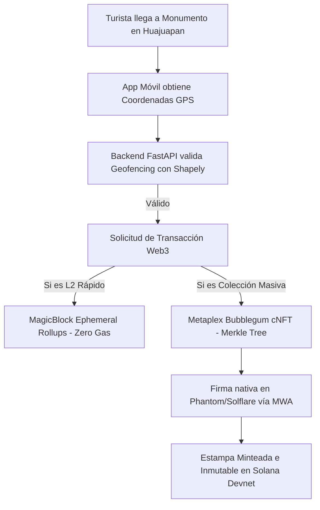

# Análisis Completo de Arquitectura & Guía de Compressed NFTs (cNFTs) 🌿

Este documento desglosa minuciosamente **todas las tecnologías integradas en la dApp Huellazo** en sus capas de Blockchain, Backend y Mobile, y explica a profundidad el funcionamiento y la propuesta de valor de los **Compressed NFTs (cNFTs)**.

---

## 🏗️ 1. Desglose Minucioso del Stack Tecnológico

El proyecto está estructurado como un **Monorepositorio** compuesto por 3 capas principales:

```text
huellazo-dApp/
├── anchor/          # Capa Blockchain (Rust, Solana & MagicBlock)
├── backend/         # Capa Off-Chain (Python FastAPI, PostgreSQL, Geofencing)
└── mobile/          # Capa Móvil (React Native, Expo, MWA, Web3.js)
```

---

### A. Capa Blockchain (`/anchor`)

1. **Rust + Anchor v0.32.0**: Framework para compilar los contratos inteligentes de Solana.
2. **Programa `huellazo` (`4pioWVSCp5oSbxbeRbquccusTkvT6Z9B8jTg7j2XXNVk`)**:
   - **`ConfigState` PDA**: Semillas `[b"config"]`. Almacena la autoridad y el contador global `total_minted`.
   - **`PoapState` PDA**: Semillas `[b"poap", owner_pubkey, token_id_u64_le]`. Registra la latitud, longitud, token URI y tipo de estampa.
   - **`Passport` PDA**: Semillas `[b"passport", user_pubkey]`. Identidad evolutiva del turista (Bronce, Plata, Oro).
   - **`Merchant` PDA**: Semillas `[b"merchant", authority]`. Datos y billetera del comercio aliado.
3. **Programa `vault` (`HLGbJxYnfKAnYxoaLyWVFMR2gQp1MKFdEtg1auK4VuRU`)**:
   - Escrow y bóveda de fondos comunitarios con transferencias por CPI al System Program.
4. **MagicBlock Ephemeral Rollups (`ephemeral-rollups-sdk`)**:
   - Macros `#[ephemeral]` con instrucciones `delegate`, `commit` y `undelegate` para transferir PDAs a capas L2 de ejecución ultra-rápida y sin comisiones de gas.
5. **Metaplex Bubblegum (`mpl-bubblegum`) & SPL State Compression**:
   - Estándar para minteo y gestión de **Compressed NFTs (cNFTs)** masivos a fracciones de centavo de dólar.

---

### B. Capa Backend Off-Chain (`/backend`)

1. **Python 3.12 + FastAPI**: API RESTful asíncrona de alto rendimiento.
2. **PostgreSQL + asyncpg**: Base de datos relacional para indexado rápido off-chain y caché de estado.
3. **Shapely & Proyecciones Azimutales**:
   - Motor de **Geofencing Anti-GPS Spoofing** que valida matemáticamente si las coordenadas del celular están dentro del polígono geográfico del monumento o negocio antes de autorizar el minteo.
4. **Autenticación Criptográfica Ed25519**:
   - Inicio de sesión sin contraseñas (`passwordless`) mediante la firma del mensaje con la llave privada de la billetera (`auth_router.py`).
5. **Solana Pay Engine**:
   - Generación de especificaciones de transacción QR con referencias de transacción (`solana_pay.py`).

---

### C. Capa Móvil / Frontend (`/mobile`)

1. **React Native + Expo (TypeScript)**: Framework cross-platform para Android, iOS y Web.
2. **Solana Mobile Wallet Adapter (MWA)**:
   - Conexión nativa de un solo toque con billeteras como **Phantom** y **Solflare** (`useAuthorization.native.ts`).
3. **Client Solana `@solana/web3.js` & Anchor IDLs**:
   - Conexión RPC a Devnet (`https://api.devnet.solana.com`), codificación binaria de instrucciones y derivador determinista de PDAs (`solana-program.ts`).
4. **Mapas Georreferenciados (`@rnmapbox/maps` & `Turf.js`)**:
   - Mapa interactivo con radar de proximidad y análisis espacial.
5. **Sistema de Diseño Neo-Brutalista "Manchones Mexicanos"**:
   - Paleta de colores: `#3D405B` (Azul Talavera), `#FAF9F6` (Crema), `#E07A5F` (Terracota), `#F2CC8F` (Mostaza).

---

## 🌲 2. ¿Qué son los Compressed NFTs (cNFTs) y por qué son clave en Huellazo?

### ¿El Problema de los NFTs Tradicionales?
En Solana convencional, cada NFT requiere crear una cuenta `Mint` y una cuenta de metadatos `Metadata`. Emitir **10,000 NFTs tradicionales** cuesta aproximadamente **15 a 20 SOL** (más de $2,500 USD) en comisiones de almacenamiento on-chain (`rent exemption`). Para un proyecto de turismo masivo con miles de turistas escaneando monumentos, esto es financieramente inviable.

### La Solución: Compressed NFTs (cNFTs) con Metaplex Bubblegum
Los **Compressed NFTs (cNFTs)** utilizan **SPL State Compression** e **hilos de Merkle Concurrentes (Concurrent Merkle Trees)**:

1. **Árbol de Merkle On-Chain**:
   - Solana **NO** guarda cada NFT en una cuenta individual. En su lugar, se crea una cuenta de árbol de Merkle (`MerkleTree`).
   - La blockchain solo almacena la **Raíz del Árbol (Merkle Root)** en 32 bytes de memoria.

2. **Reducción de Costos del 99.99%**:
   - 10,000 NFTs Tradicionales: **~15.0 SOL**
   - 10,000 Compressed NFTs (cNFTs): **~0.005 SOL** (~$0.80 USD en total).
   - ¡Cada estampa de viaje cuesta **menos de 0.0001 USD**!

3. **Indexación Read-API Off-Chain**:
   - Los datos detallados de cada estampa (imagen, coordenadas, fecha de visita) son indexados por nodos Read-API (como Helius o Triton) que leen las transacciones pasadas de Solana.

4. **Descompresión (Uncompress) Híbrida**:
   - Mediante **Metaplex Bubblegum**, si un usuario desea transferir o vender su estampa en un marketplace secundario tradicional (como Magic Eden o Tensor), puede invocar la función `uncompress`, convirtiendo su cNFT en un NFT tradicional de Solana en el momento que lo necesite.

---

## 🎯 3. Resumen de Flujo Completo


