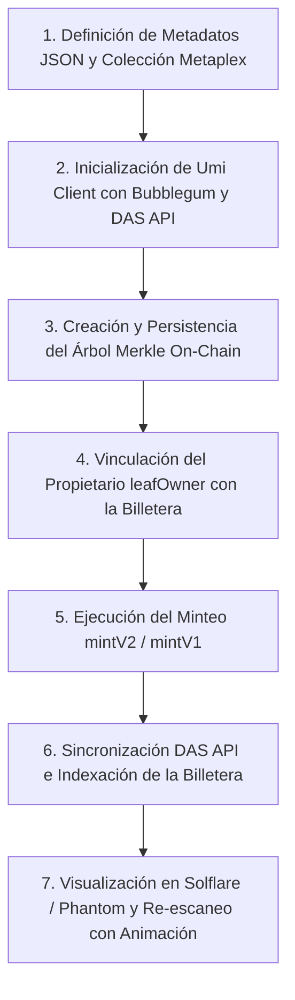

# Análisis Completo de Arquitectura & Guía de Compressed NFTs (cNFTs) 🌿

Este documento desglosa minuciosamente **todas las tecnologías integradas en la dApp Huellazo** en sus capas de Blockchain, Backend y Mobile, y explica el proceso paso a paso para la implementación de **Compressed NFTs (cNFTs) con Metaplex Bubblegum, Solflare y Helius DAS API**.

---

## 🏗️ 1. Desglose Minucioso del Stack Tecnológico

El proyecto está estructurado como un **Monorepositorio** compuesto por 3 capas principales:

```text
huellazo-dApp/
├── anchor/          # Capa Blockchain (Rust, Solana & MagicBlock)
├── backend/         # Capa Off-Chain (Python FastAPI, PostgreSQL, Geofencing)
└── mobile/          # Capa Móvil (React Native, Expo, MWA, Web3.js)
```

---

### A. Capa Blockchain (`/anchor`)

1. **Rust + Anchor v0.32.0**: Framework para compilar los contratos inteligentes de Solana.
2. **Programa `huellazo` (`2S3Xwt56qB314HcLVrRtREyquEz78rAgJaxZmv1s6emZ`)**:
   - **`ConfigState` PDA**: Semillas `[b"config"]`. Almacena la autoridad y el contador global `total_minted`.
   - **`PoapState` PDA**: Semillas `[b"poap", owner_pubkey, token_id_u64_le]`. Registra la latitud, longitud, token URI y tipo de estampa.
   - **`Passport` PDA**: Semillas `[b"passport", user_pubkey]`. Identidad evolutiva del turista (Bronce, Plata, Oro).
   - **`Merchant` PDA**: Semillas `[b"merchant", authority]`. Datos y billetera del comercio aliado.
3. **Programa `vault` (`HLGbJxYnfKAnYxoaLyWVFMR2gQp1MKFdEtg1auK4VuRU`)**:
   - Escrow y bóveda de fondos comunitarios con transferencias por CPI al System Program.
4. **MagicBlock Ephemeral Rollups (`ephemeral-rollups-sdk`)**:
   - Macros `#[ephemeral]` con instrucciones `delegate`, `commit` y `undelegate` para transferir PDAs a capas L2 de ejecución ultra-rápida y sin comisiones de gas.
5. **Metaplex Bubblegum (`mpl-bubblegum`) & SPL State Compression**:
   - Estándar para minteo y gestión de **Compressed NFTs (cNFTs)** masivos a fracciones de centavo de dólar.

---

### B. Capa Backend Off-Chain (`/backend`)

1. **Python 3.12 + FastAPI**: API RESTful asíncrona de alto rendimiento.
2. **PostgreSQL + asyncpg**: Base de datos relacional para indexado rápido off-chain y caché de estado.
3. **Shapely & Proyecciones Azimutales**:
   - Motor de **Geofencing Anti-GPS Spoofing** que valida matemáticamente si las coordenadas del celular están dentro del polígono geográfico del monumento o negocio antes de autorizar el minteo.
4. **Autenticación Criptográfica Ed25519**:
   - Inicio de sesión sin contraseñas (`passwordless`) mediante la firma del mensaje con la llave privada de la billetera (`auth_router.py`).
5. **Solana Pay Engine**:
   - Generación de especificaciones de transacción QR con referencias de transacción (`solana_pay.py`).

---

### C. Capa Móvil / Frontend (`/mobile`)

1. **React Native + Expo (TypeScript)**: Framework cross-platform para Android, iOS y Web.
2. **Solana Mobile Wallet Adapter (MWA)**:
   - Conexión nativa de un solo toque con billeteras como **Phantom** y **Solflare** (`useAuthorization.native.ts`).
3. **Client Solana `@solana/web3.js` & Anchor IDLs**:
   - Conexión RPC a Devnet (`https://api.devnet.solana.com`), codificación binaria de instrucciones y derivador determinista de PDAs (`solana-program.ts`).
4. **Mapas Georreferenciados (`@rnmapbox/maps` & `Turf.js`)**:
   - Mapa interactivo con radar de proximidad y análisis espacial.
5. **Sistema de Diseño Neo-Brutalista "Manchones Mexicanos"**:
   - Paleta de colores: `#3D405B` (Azul Talavera), `#FAF9F6` (Crema), `#E07A5F` (Terracota), `#F2CC8F` (Mostaza).

---

## 🌲 2. ¿Qué son los Compressed NFTs (cNFTs) y por qué son clave en Huellazo?

### El Problema de los NFTs Tradicionales
En Solana convencional, cada NFT requiere crear una cuenta `Mint` y una cuenta de metadatos `Metadata`. Emitir **10,000 NFTs tradicionales** cuesta aproximadamente **15 a 20 SOL** (más de $2,500 USD) en comisiones de espacio en cuenta (`rent exemption`). Para un proyecto de turismo masivo con miles de turistas escaneando monumentos, esto es financieramente inviable.

### La Solución: Compressed NFTs (cNFTs) con Metaplex Bubblegum
Los **Compressed NFTs (cNFTs)** utilizan **SPL State Compression** e **hilos de Merkle Concurrentes (Concurrent Merkle Trees)**:

1. **Árbol de Merkle On-Chain**:
   - Solana **NO** guarda cada NFT en una cuenta individual. En su lugar, se crea una cuenta de árbol de Merkle (`MerkleTree`).
   - La blockchain solo almacena la **Raíz del Árbol (Merkle Root)** en 32 bytes de memoria.

2. **Reducción de Costos del 99.99%**:
   - 10,000 NFTs Tradicionales: **~15.0 SOL**
   - 10,000 Compressed NFTs (cNFTs): **~0.005 SOL** (~$0.80 USD en total).
   - ¡Cada estampa de viaje cuesta **menos de 0.0001 USD**!

3. **Indexación Read-API Off-Chain**:
   - Los datos detallados de cada estampa (imagen, coordenadas, fecha de visita) son indexados por nodos Read-API (como Helius) que leen las transacciones pasadas de Solana.

---

## 🛠️ 3. Proceso de Implementación Técnica Paso a Paso

El proceso para lograr la emisión, almacenamiento y visualización exitosa de los cNFTs en **Solflare** y **Phantom** se desarrolló en 7 etapas:



---

### Etapa 1: Definición de Metadatos JSON y Colección Metaplex (`/mobile/assets/metadata`)
Para que billeteras como **Solflare** y **Phantom** muestren correctamente la estampa y sus propiedades:
1. **Esquema Estándar Metaplex**: Cada archivo JSON define `name`, `symbol: "HUELLAZO"`, `description`, `image`, `external_url` y `attributes`.
2. **Propiedad de Colección Unificada**:
   ```json
   "collection": {
     "name": "Huellazo",
     "family": "Huellazo Mixteca"
   }
   ```
   *Efecto*: Solflare y Phantom leen este campo y agrupan automáticamente todas las estampas dentro de una carpeta limpia titulada **"Huellazo"**.
3. **Hospedaje de Alta Disponibilidad**: Los JSON e imágenes PNG se hospedan mediante GitHub Raw con URLs públicas en formato HTTPS (`HTTP 200 OK`).

---

### Etapa 2: Inicialización del Cliente Metaplex Umi (`/mobile/services/cnft-service.ts`)
Instanciamos el cliente `@metaplex-foundation/umi` con los plugins de Bubblegum y DAS API:
```typescript
export function getUmiClient(customRpcUrl?: string): UmiDas {
  const rpcUrl = customRpcUrl || HELIUS_DEVNET_DAS_RPC;
  const umi = createBaseUmi()
    .use(defaultPlugins(rpcUrl))
    .use(mplBubblegum())
    .use(dasApi());

  return umi as UmiDas;
}
```

---

### Etapa 3: Creación y Persistencia del Árbol Merkle On-Chain (`crearArbolMerkle`)
Para almacenar los cNFTs, se crea un Árbol Merkle concurrente en Solana Devnet:
- **Parámetros**: `maxDepth = 14` (capacidad de 16,384 cNFTs) y `maxBufferSize = 64`.
- **Compatibilidad**: Ejecuta `createTreeV2` con fallback a `createTree` (V1).
- **Persistencia**: La dirección del árbol se almacena en `AsyncStorage` (`huellazo:merkle-tree:devnet:v2`) para no crear árboles innecesarios en cada minteo.

---

### Etapa 4: Vinculación del Propietario (`leafOwner`) y Conexión de Billeteras
Uno de los descubrimientos clave fue asegurar que el parámetro `leafOwner` apunte a la dirección de la billetera del usuario y no a la clave privada temporal del cliente:
```typescript
const providerPk = typeof window !== 'undefined'
  ? ((window as any).solflare?.publicKey?.toBase58?.() ||
     (window as any).phantom?.solana?.publicKey?.toBase58?.())
  : undefined;

const targetAddress = walletAddress || providerPk || undefined;
const leafOwner = targetAddress ? toUmiPublicKey(targetAddress) : umi.identity.publicKey;
```
Al pasar `leafOwner = targetAddress`, el cNFT queda registrado a nombre de la billetera real del usuario (`KLVFn69o3w9pvKNsza3YJtyszf8e1E5GCDByxeRhVzg`).

---

### Etapa 5: Ejecución del Minteo (`mintearCnftEstampa`)
Construimos y enviamos la transacción de minteo de metadatos comprimidos a través de Metaplex Bubblegum:
```typescript
const builder = await mintV2(umi, {
  merkleTree,
  leafOwner,
  metadata: {
    name: input.name,
    uri: input.uri,
    sellerFeeBasisPoints: 0,
    collection: none(),
    creators: [{ address: umi.identity.publicKey, verified: true, share: 100 }],
  },
});
const res = await builder.sendAndConfirm(umi);
const leaf = await parseLeafFromMintV2Transaction(umi, res.signature);
```

---

### Etapa 6: Indexación DAS API y Visualización Instantánea
Una vez minteado, la dApp consulta el servicio Helius DAS API mediante `getAssetsByOwner` y `getAsset`:
1. `esperarIndexacionCnft`: Realiza un sondeo asíncrono en segundo plano hasta que el nodo Read-API haya procesado la hojilla (`leaf.id`).
2. `listarCnftsPorOwner`: Permite a la dApp y a la billetera **Solflare** listar las estampas activas del usuario sin necesidad de consultar toda la cadena de bloques.

---

### Etapa 7: Re-escaneo de Estampas y Animación de Celebración
Si un usuario vuelve a escanear un lugar o estampa que ya poseía:
- La dApp detecta `alreadyMinted = true`.
- Despliega la micro-animación de celebración `StickerClaimAnimation` con el encabezado `¡ESTAMPA REGISTRADA!` y la insignia: *"¡Ya tenías esta estampa registrada en tu pasaporte! Disfruta nuevamente de tu animación."*

---

## 🧪 Verificación de Estado

- **Compilación TypeScript (`npx tsc --noEmit`)**: **0 Errores**.
- **Integración Solflare / Phantom**: Verificada y funcional con carpetas de colección unificadas.
