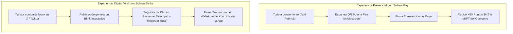

# Solana Pay vs. Solana Blinks (Actions) — Análisis de Integración en Huellazo ☀️

Este documento analiza las diferencias, beneficios estratégicos y propuestas de integración práctica para **Solana Pay** y **Solana Blinks** dentro del ecosistema de la dApp **Huellazo**.

---

## 📊 1. Cuadro Comparativo: Solana Pay vs. Solana Blinks

| Criterio | 💳 Solana Pay | 🔗 Solana Blinks (Blockchain Links / Actions) |
| :--- | :--- | :--- |
| **¿Qué es?** | Protocolo de **pagos punto de venta (PoS)** mediante códigos QR o enlaces `solana:`. | Especificación de **componentes interactivos** que transforman URLs en transacciones Web3 de 1-clic. |
| **Canal Principal** | Comercios físicos, mostradores, cobro presencial en ventanilla. | Redes Sociales (X/Twitter, Discord, Telegram, sitios web, blogs). |
| **Estándar Tecnológico** | `solana:<recipient>?amount=X&label=Y&message=Z` | `GET /actions.json` + `GET/POST /api/v1/blinks/...` (JSON Metadata). |
| **Experiencia de Usuario** | El turista abre la dApp o wallet -> Escanea el QR físico en la caja -> Confirma el pago en SOL/$HZ. | El usuario ve una publicación en X -> Da clic en "Reclamar Estampa" o "Reservar Ruta" -> Firma en su wallet sin salir de X. |
| **Propósito Principal** | **Liquidar consumos presenciales** en comercios aliados sin intermediarios bancarios. | **Viralización digital fuera de la app** (Convertir usuarios Web2 en Web3 desde redes sociales). |

---

## 🌟 2. Beneficios Clave para Huellazo

### Beneficios de Solana Pay:
1. **Cero Comisiones Bancarias para Comercios Locales**: Los negocios de Huajuapan evitan las comisiones del 3% al 5% de las terminales tradicionales.
2. **Recompensas Instantáneas**: Cada pago genera automáticamente **Puntos $HZ** tokenizados en la cuenta del usuario.
3. **Infraestructura de Bajo Costo**: Solo requiere un código QR impreso en el mostrador del establecimiento.

### Beneficios de Solana Blinks:
1. **Viralidad en Redes Sociales**: Los turistas comparten sus logros y estampas en X/Twitter. Sus seguidores interactúan con el **Blink** y firman transacciones directamente desde la publicación.
2. **E-Commerce Descentralizado para Artesanos**: Venta directa de artesanías de palma, cerámica y café de especialidad sin pagar comisiones a plataformas externas.
3. **Distribución de Pases y Promociones**: Campañas culturales (como la Guelaguetza) que regalan pases o cNFTs conmemorativos mediante publicaciones en redes sociales.

---

## 💡 3. Sugerencia de Integración en el Flujo de Huellazo

### Propuesta de Implementación para Blinks en Huellazo:
- **`Blink 1: Reclamo de Estampa Conmemorativa`**:
  - Enlace: `https://huellazo.app/api/v1/blinks/claim-stamp?poiId=jaguarcito`
  - Permite a usuarios en X/Twitter reclamar un cNFT promocional y conocer la dApp.
- **`Blink 2: Reserva de Ruta Ecoturística`**:
  - Enlace: `https://huellazo.app/api/v1/blinks/book-route?routeId=yukunitza`
  - Permite pagar la entrada o guiado a las zonas turísticas de Huajuapan con 1-clic.
- **`Blink 3: Compra Directa a Artesanos`**:
  - Enlace: `https://huellazo.app/api/v1/blinks/buy-craft?itemId=pulque_artesanal`
  - Apoyo directo a productores de La Casa de Humo y Fonda Julita.
