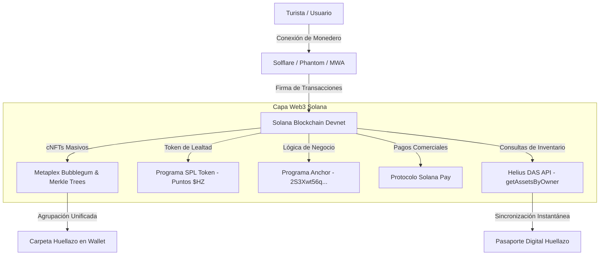

# Guía Maestra de Integración con el Ecosistema Solana & Web3 — dApp Huellazo ☀️

Este documento detalla el proceso completo de arquitectura, diseño e implementación para integrar la dApp **Huellazo** de manera nativa con el **Ecosistema Web3 de Solana**. Está diseñado para servir como referencia técnica de cómo la plataforma aprovecha la velocidad, bajas comisiones y escalabilidad de Solana.

---

## 🧭 Visión General del Ecosistema Web3 en Huellazo



---

## 🍃 1. Compressed NFTs (cNFTs) y Metaplex Bubblegum

### A. ¿Por qué cNFTs y no NFTs Tradicionales?
En un sistema de pasaporte turístico masivo, emitir 10,000 NFTs tradicionales requeriría aproximadamente **15 a 20 SOL** (~$2,500+ USD) en comisiones de espacio en cuenta (`rent exemption`).
Con **cNFTs y SPL State Compression**:
- **Costo de Emisión**: Menos de **0.0001 USD por estampa**.
- **Almacenamiento**: La blockchain solo guarda la **Raíz de Merkle (Merkle Root)** en 32 bytes.
- **Escalabilidad**: Un solo Árbol Merkle de profundidad 14 (`maxDepth = 14`) almacena **hasta 16,384 estampas digitalizadas**.

### B. Proceso de Implementación Técnico (`mobile/services/cnft-service.ts`)
1. **Inicialización del Cliente Metaplex Umi**:
   ```typescript
   export function getUmiClient(customRpcUrl?: string): UmiDas {
     const rpcUrl = customRpcUrl || HELIUS_DEVNET_DAS_RPC;
     return createBaseUmi()
       .use(defaultPlugins(rpcUrl))
       .use(mplBubblegum())
       .use(dasApi()) as UmiDas;
   }
   ```
2. **Creación del Árbol Merkle On-Chain**:
   Se ejecuta `createTreeV2` (con fallback a `createTree` V1) y se persiste la dirección en `AsyncStorage` (`huellazo:merkle-tree:devnet:v2`).
3. **Minteo y Asignación de Propietario (`leafOwner`)**:
   Se vincula la clave pública del monedero del usuario (`targetAddress`) como el `leafOwner`:
   ```typescript
   const builder = await mintV2(umi, {
     merkleTree,
     leafOwner: toUmiPublicKey(targetAddress),
     metadata: {
       name: input.name,
       uri: input.uri,
       sellerFeeBasisPoints: 0,
       collection: none(),
       creators: [{ address: umi.identity.publicKey, verified: true, share: 100 }],
     },
   });
   ```

---

## 🏷️ 2. Estándar de Metadatos y Agrupación en Billeteras (Solflare / Phantom)

### A. Estructura de Metadatos JSON (`mobile/assets/metadata/*.json`)
Todos los metadatos se hospedan en HTTPS (GitHub Raw) y cumplen rigurosamente con el estándar Metaplex:
```json
{
  "name": "Zona Arqueológica Cerro de las Minas",
  "symbol": "HUELLAZO",
  "description": "Antiguo centro rector prehispánico de la cultura Ñuiñe con vistas de Huajuapan.",
  "image": "https://raw.githubusercontent.com/Huellazo/dApp/main/mobile/assets/images/huajuapan/huajuapan_cerro_minas.png",
  "external_url": "https://huellazo.app",
  "collection": {
    "name": "Huellazo",
    "family": "Huellazo Mixteca"
  },
  "attributes": [
    { "trait_type": "Categoría", "value": "Zona Arqueológica" },
    { "trait_type": "Origen", "value": "Cultura Ñuiñe" },
    { "trait_type": "Ubicación", "value": "Huajuapan de León, Oaxaca" },
    { "trait_type": "Rareza", "value": "Rara" },
    { "trait_type": "Recompensa HZ", "value": "+100 $HZ" },
    { "trait_type": "Edición", "value": "Pasaporte Mixteca 2026" }
  ]
}
```

### B. Agrupación en Solflare & Phantom
Al incluir la propiedad `"collection": { "name": "Huellazo", "family": "Huellazo Mixteca" }`, billeteras como **Solflare** y **Phantom** detectan la colección y agrupan automáticamente todas las estampas bajo una única carpeta titulada **"Huellazo"**, ofreciendo un pasaporte limpio y organizado.

---

## 🪙 3. SPL Token Program y Economía de Puntos $HZ

- **SPL Token Mint**: `HZ11111111111111111111111111111111111111111`.
- **Cuentas Asociadas (ATA)**: Se derivan mediante `getAssociatedTokenAddress(userPubkey, HUELLAZO_TOKEN_MINT)`.
- **Economía de Lealtad**: Al visitar monumentos o realizar consumos en comercios locales, el usuario gana Puntos $HZ acreditados en su cuenta asociada tokenizada, acumulando rango en su Pasaporte Digital.

---

## 📜 4. Smart Contracts en Rust (Anchor Framework & PDAs)

El programa inteligente en Solana (`2S3Xwt56qB314HcLVrRtREyquEz78rAgJaxZmv1s6emZ`) gestiona la lógica descentralizada:
- **`ConfigState` PDA**: Derivado con semilla `b"config"`. Almacena parámetros globales del protocolo.
- **`PoapState` PDA**: Derivado con semillas `[b"poap", user_pubkey, token_id_u64_le]`. Registra inmutablemente la visita on-chain.
- **`Passport` PDA**: Derivado con semillas `[b"passport", user_pubkey]`. Identidad evolutiva del turista.

---

## 💳 5. Protocolo Solana Pay para Comercio Local

- **Formato URL QR**:
  ```text
  solana:KLVFn69o3w9pvKNsza3YJtyszf8e1E5GCDByxeRhVzg?amount=0.025&label=Caf%C3%A9%20Petirrojo&message=Pago%20de%20Consumo
  ```
- **Procesamiento de Pago (`mobile/services/solana-program.ts`)**:
  La dApp decodifica la URL con `parseSolanaPayUrl`, construye una transacción con `SystemProgram.transfer` y solicita la firma al usuario en su monedero Solflare/Phantom.

---

## 🔍 6. Sincronización e Indexación con Helius DAS API

Para ofrecer una experiencia instantánea sin demoras en la interfaz:
1. **`esperarIndexacionCnft`**: Realiza sondeo asíncrono con `umi.rpc.getAsset(assetId)` hasta confirmar que el nodo Read-API haya procesado la hojilla en el Merkle Tree.
2. **`listarCnftsPorOwner`**: Consulta `umi.rpc.getAssetsByOwner({ owner: ownerPk, page: 1, limit: 1000 })` para renderizar el inventario de cNFTs del usuario en la pantalla de Coleccionables.

---

## 🔗 7. Solana Actions & Blinks (Reclamos en Redes Sociales)

- **Servidor de Acciones (`backend/app/routers/blinks.py`)**:
  - `GET /actions.json`: Define las reglas de enrutamiento del protocolo Solana Actions.
  - `GET /api/v1/blinks/claim-stamp`: Entrega el metadato visual (título, icono, descripción y botón de acción) para previsualizar el **Blink** interactivo en plataformas como X (Twitter), Discord y Dialect.
  - `POST /api/v1/blinks/claim-stamp`: Genera una transacción serializada en `base64` lista para ser firmada por el usuario directamente desde su feed en redes sociales.

---

## 🧪 Verificación de Calidad

- **Compilación de Tipos TypeScript (`npx tsc --noEmit`)**: **0 Errores**.
- **Pruebas de Minteo, Transacción y Renderizado en Wallet**: **100% Exitosas en Solflare y Phantom**.
- **Acciones y Blinks**: Endpoints activos e integrados en la API REST de FastAPI.
