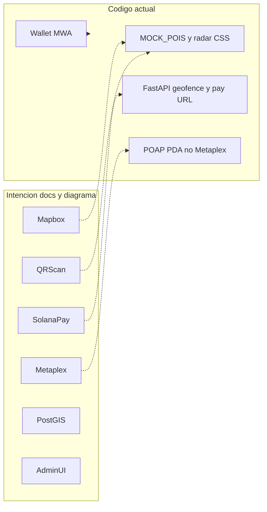

# Auditoría de estado: Huellazo

> **For agentic workers:** Analysis/report only. Do not change product code. Use graphify CLI first. All generated or modified documentation MUST land in `docs/` as markdown.

**Goal:** Producir un reporte de estado en `docs/` que deje claro qué está construido, qué está documentado pero no existe, qué hay que corregir ya, y qué implementar después.

**Architecture of the review:** Cuatro fuentes: (1) grafo graphify del repo, (2) intención en [`docs/`](docs/), (3) diagrama [`docs/arquitectura actualizada.jpeg`](docs/arquitectura%20actualizada.jpeg), (4) citas puntuales de código solo donde el grafo no baste.

**Tech stack under review:** Expo 54 / React Native, FastAPI + PostgreSQL, Anchor (`huellazo` + `vault`), MWA.

---

## Hallazgo previo (ya confirmado en exploración)

El repo actual **no** es el layout de [`docs/huellazo-report.md`](docs/huellazo-report.md) (`huellazo-app` Vite + programas bajo `backend/`). Es este monorepo:

```text
anchor/     # programas Rust (huellazo POAP + vault)
backend/    # FastAPI + Shapely (no PostGIS)
mobile/     # Expo / expo-router (único frontend)
docs/       # intención de producto + reportes stale
```

La app móvil es un prototipo neo-brutalista sobre mocks, con restos de **cause-pots**. El backend y el programa Anchor existen pero están desconectados de las pantallas y entre sí (IDs/IDL/tests).



---

## Entregables (todo markdown de auditoría vive en `docs/`)

Producto / código: no se modifica. Solo se **crea o actualiza markdown en [`docs/`](docs/)**.

1. **Reporte principal (español):** [`docs/estado-proyecto-2026-08-17.md`](docs/estado-proyecto-2026-08-17.md) — observaciones, correcciones, sugerencias, roadmap.
2. **Salida graphify copiada a docs:** [`docs/graphify-GRAPH_REPORT.md`](docs/graphify-GRAPH_REPORT.md) — copia (o extracto fechado) de `graphify-out/GRAPH_REPORT.md` para que el grafo quede versionable junto al resto de la documentación. El binario/HTML puede quedarse en `graphify-out/` (artefacto de herramienta); el markdown sí va a `docs/`.
3. **Notas de consulta del grafo:** [`docs/graphify-consultas.md`](docs/graphify-consultas.md) — preguntas hechas (`graphify query` / `path`), hallazgos y `source_location`. Evita re-explorar el repo en chats futuros.
4. **Docs existentes tocados (si aplica):** banner “stale / layout antiguo” al inicio de [`docs/huellazo-report.md`](docs/huellazo-report.md), [`docs/cause-report.md`](docs/cause-report.md) y mermaid asociados — sin borrar el histórico.
5. **Canvas (extra visual, no sustituye a docs):** [`huellazo-estado-proyecto.canvas.tsx`](/home/m4r10/.cursor/projects/home-m4r10-Documents-projects-dApp/canvases/huellazo-estado-proyecto.canvas.tsx) — semáforo y backlog; el usuario abre al lado del chat.

Skills: `@graphify` (CLI local), `@solana-dev` para recomendaciones de stack, canvas skill al escribir el `.canvas.tsx`.

---

## Graphify (CLI local, primer paso obligatorio)

El usuario ya tiene graphify instalado. **No** reconstruir el pipeline a mano. Desde la raíz del repo:

```bash
# Si ya existe graphify-out/graph.json → incremental
graphify . --update

# Si no hay grafo → build completo (HTML por defecto)
graphify .

# Si el corpus dispara el warning (>500 archivos / 2M palabras):
# acotar a código+docs de producto, no node_modules ni lockfiles
graphify anchor --update
graphify backend --update
graphify mobile --update
graphify docs --update
```

Luego **consultar**, no releer árboles enteros:

```bash
graphify query "How does the mobile app connect wallet, API, and mint?"
graphify query "Where are Solana Pay, geofence, and visit validation implemented?"
graphify path "mint_place" "payments"
graphify explain "PoapState"
```

Reglas:

- Si `graphify-out/graph.json` existe, saltar el build y ir a `query` (salvo que `--update` sea necesario por docs nuevas).
- Citar `source_location` del grafo; abrir archivos solo para confirmar gaps P0 (IDs, IDL, imports de Mapbox).
- Copiar `graphify-out/GRAPH_REPORT.md` → `docs/graphify-GRAPH_REPORT.md` y registrar las queries en `docs/graphify-consultas.md`.

---

## Estructura del reporte

### 1. Resumen ejecutivo

Una página: salud del MVP vs lo prometido en [`docs/planeacion.md`](docs/planeacion.md) (Fase 1–2) y [`docs/S2 Documentacion de Huellazo.txt`](docs/S2%20Documentacion%20de%20Huellazo.txt). Veredicto: prototipo de UI + esqueleto on-chain/API, no MVP conectado.

### 2. Matriz docs vs código vs diagrama

Por cada bloque del JPEG (Usuarios / Frontend / Backend / Web3), estado: **hecho / parcial / mock / ausente**.

Candidatos ya identificados (verificar en archivos citados, no inventar):

- Login MWA: parcial — wallet existe; roles turista/negocio/admin no están gated de verdad. Tabs en `mobile/` (`tourism`, `business`, `scan`, `passport`, `wallet`).
- Mapbox + Turf: dependencias en `mobile/package.json` (`@rnmapbox/maps`, `expo-location`) **sin imports** en TSX. Radar con coordenadas CSS. Estudio de usuarios ya pidió mapa real ([`docs/Validación Inicial con Usuarios_ Huellazo.docx.txt`](docs/Validación%20Inicial%20con%20Usuarios_%20Huellazo.docx.txt)).
- Cámara / QR: copy de escáner sin `expo-camera` / barcode. `react-qr-code` solo en receive de wallet; QR de trade es fake.
- Solana Pay: backend arma URL en [`backend/app/routers/payments.py`](backend/app/routers/payments.py); mobile no la consume. No hay `@solana/pay`.
- Recompensas Token/NFT: `mint_place` / `mint_business` crean PDA `PoapState`, no SPL ni Metaplex/Bubblegum. Mobile simula mint (`network: 'solana-devnet-simulated'`).
- Tesorería / vault: programa vault existe, no cableado al flujo QR.
- Pyth, Bonfida SNS, Blinks, Jupiter, PostGIS: solo en diagrama/docs.
- Admin: `PATCH` de propuestas y `POST` merchants **sin auth**. Sin UI admin.
- Geofence: Shapely real en `POST /api/visits/validate`; mobile no lo llama (usa `Math.random` como “Fake GPS”).
- Diagrama dice “NoSQL Postgres SQLite” y “PostGIS”: el código es PostgreSQL + Shapely. Corregir el diagrama o el stack, no ambos a la vez.

### 3. Observaciones por capa

**Mobile** ([`mobile/`](mobile/))

- Nombre del package sigue siendo `pots`; storage `@cause_pots:*`; API default puerto 3000 vs FastAPI 8000.
- UI de pots/friends no usada por tabs actuales.
- Cluster hardcodeado a Devnet público; ignora `EXPO_PUBLIC_SOLANA_RPC`.
- Duplicados `BrutalistButton` / `brutalist-button`.
- Gamificación README (overclock, piñata, trade P2P, feed) es estado local, no cadena.

**Backend** ([`backend/`](backend/))

- Auth Ed25519, merchants, visits, proposals, payments: implementados como API.
- Alembic en requirements, sin carpeta de migraciones.
- Endpoints admin/propuestas sin autorización.
- Front-test HTML apunta a puerto 5000 y rutas que no existen.

**Anchor** ([`anchor/programs/huellazo`](anchor/programs/huellazo))

- `declare_id!` `4pioWVSC…` vs `.env.example` / `config.py` / `Anchor.toml` `CB2sVYQ…`.
- IDL en [`mobile/idl/huellazo.json`](mobile/idl/huellazo.json) describe `initializePassport` / `recordVisit` — **no** el `lib.rs` actual.
- Tests TS en [`anchor/tests/anchor.ts`](anchor/tests/anchor.ts) contra el API viejo. Únicos tests vivos: vault LiteSVM.
- `MAX_DISTANCE_METERS` no se usa on-chain (comentario: valida el frontend; el frontend tampoco valida).
- MagicBlock ephemeral rollups en el programa: documentar si sigue siendo decisión o deuda.

### 4. Correcciones (deuda técnica, no código en esta pasada)

Prioridad P0 (rompe el MVP o miente al usuario):

- Unificar Program ID + regenerar IDL + reescribir tests al programa actual.
- Cablear mobile → FastAPI (`EXPO_PUBLIC_API_URL` :8000) y RPC del `.env`.
- Quitar o aislar cause-pots (idl `contract.json`, store pots, tab leftovers).
- No mostrar “escáner / mint en Solana” si es simulado; alinear copy con el estudio UX (sin jerga “menta NFT”).

P1:

- Auth en rutas de merchants/propuestas.
- Migraciones reales o `create_all` documentado.
- Usar Mapbox de verdad o quitar la dependencia.
- Conectar `visits/validate` + Solana Pay URL a las pantallas.

### 5. Sugerencias de producto y stack

Alinear con `@solana-dev` y [`docs/documentacionSolana.md`](docs/documentacionSolana.md), pero recortar YAGNI:

- **MVP on-chain:** mantener POAP PDA *o* pasar a Token Metadata estándar; Bubblegum es nice-to-have (Fase 3), no bloqueante.
- Pagos: Solana Pay + USDC; no Pyth hasta que haya FX real.
- Geo: Mapbox nativo + validación backend Shapely; PostGIS solo si hay queries espaciales pesadas.
- UX: aplicar pivotes del estudio (mapa bajo el radar, “estampa/medalla”, “Regístrate”, CTA de cupón claro).
- Roles: tres experiencias (turista / local / admin) como el diagrama, no cinco tabs genéricos.

### 6. Futuras implementaciones (roadmap)

Orden propuesto vs [`docs/planeacion.md`](docs/planeacion.md):

- **Ahora (cerrar Fase 1):** IDs/IDL/tests, wallet+API reales, limpiar fork, copy UX.
- **Siguiente (Fase 2 real):** mapa GPS, QR cámara, geofence, Solana Pay, mint PDA o NFT metadata al escanear.
- **Después (Fase 3):** propuestas con foto+auth admin, tesorería/escrow, token HUELLA, Bubblegum si el volumen lo justifica.
- **Más tarde:** Blinks, SNS, Pyth, DAO/staking.

Cada ítem en el reporte citará archivo y esfuerzo relativo (S/M/L).

### 7. Documentación a marcar como stale

En el reporte (sin borrar aún, salvo que pidas limpieza):

- [`docs/huellazo-report.md`](docs/huellazo-report.md) y `huellazo-architecture.mmd` → repo viejo
- [`docs/cause-report.md`](docs/cause-report.md) / `cause-architecture.mmd` → plantilla, no Huellazo
- README afirma Mapbox, anti-spoof y passport dinámico on-chain; hay que actualizarlo cuando se implemente, no antes

---

## Método de ejecución (cuando apruebes)

1. Comprobar `graphify-out/graph.json`. Ejecutar `graphify . --update` o `graphify .` por CLI.
2. Copiar `GRAPH_REPORT.md` a [`docs/graphify-GRAPH_REPORT.md`](docs/graphify-GRAPH_REPORT.md).
3. Correr las queries de gaps (wallet, mint, pay, geo, IDL) y guardarlas en [`docs/graphify-consultas.md`](docs/graphify-consultas.md).
4. Completar la matriz docs vs código vs diagrama con citas del grafo + 4–6 archivos ancla si hace falta (`lib.rs`, `payments.py`, IDL, `.env.example`, tabs mobile).
5. Escribir [`docs/estado-proyecto-2026-08-17.md`](docs/estado-proyecto-2026-08-17.md) y marcar docs stale en su propio markdown.
6. Crear el canvas (visual). En el chat: resumen corto + enlaces a los `.md` en `docs/` y al canvas.

Fuera de alcance: implementar features, desplegar, borrar cause-pots, regenerar IDL. Eso sería un plan de implementación posterior. `graphify-out/` es cache de herramienta; la documentación durable es la de `docs/`.